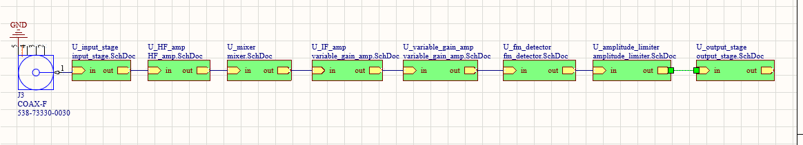

# Projects
This engineering portfolio contains all of the engineering projects I have worked on. Things that I'm allowed to share (mainly personal projects) are located in the "public" folder. The "private" folder contains projects for my research lab and other projects which I cannot share.

The project which I am the most proud of, which is still a work in progress, is the FM radio receiver that I am currently building. 

I am currently designing it in Altium Designer. I've taken detailed notes on my design process, tradeoffs, part selection, and more in this repo: https://github.com/piyushsud/knowledge/tree/master

The design for each stage in the radio is a LaTex PDF under the respective folder for each stage, under knowledge/Project_Specific_Knowledge/public/fm_radio/stages. I've also put some less organized notes in the brain dump folder.  

If you have any questions, feel free to reach out at piyushsud@gmail.com!.

HF amp:

Mixer:

LO:

Variable gain amp:

